# Content Tagging & Competency Mapping (CTCM)

**Team 2 — AI Data Center Operations Capstone**

CTCM is an AI-powered service that analyzes learning content and automatically generates structured educational metadata, including:

- Content summaries
- Topic tags
- Difficulty levels
- Competency / skill mappings
- Confidence scores
- Supporting notes

The project combines **RAG, multimodal content extraction, local GPU inference, OpenAI inference, vLLM continuous batching, Docker, Kubernetes, Prometheus, Grafana, and Streamlit** in one end-to-end AI service.

---

## Demo

### Streamlit Application

The Streamlit interface allows users to upload learning content, select an inference backend, and view the generated tagging and competency-mapping results.

<p align="center">
  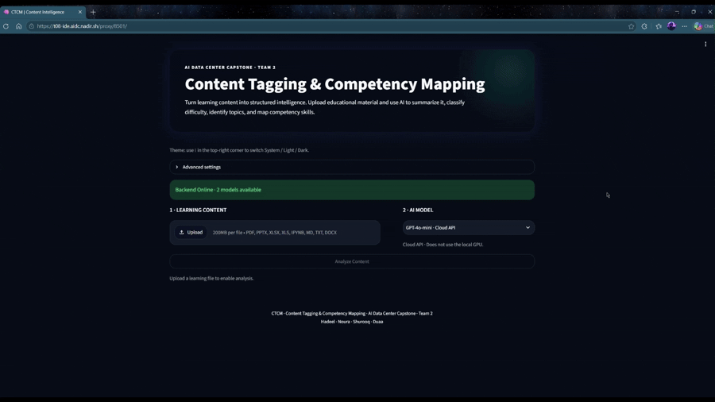
</p>

### Grafana Observability Dashboard

The Grafana dashboard provides visibility into service availability, request rate, latency, errors, Qwen/vLLM inference activity, TTFT, TPOT, token throughput, and concurrent GPU requests.

<p align="center">
  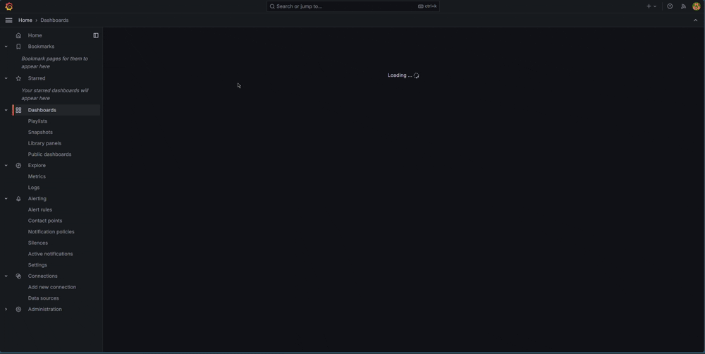
</p>

---

## System Architecture

```text
Learning Content
PPTX / PDF / XLSX / IPYNB / Images / Code / Text
        |
        v
Content Extraction
Text + Images + OCR
        |
        v
Digest / Preprocessing
        |
        +-----------------------------+
        |                             |
        v                             v
Qwen + vLLM                     OpenAI API
AsyncLLMEngine                  gpt-4o-mini
Local NVIDIA GPU                External API
        |                             |
        +--------------+--------------+
                       |
                       v
                3-Pass Pipeline
        1. Tags + initial skills
        2. RAG skill refinement
        3. Difficulty refinement
                       |
                       v
             Structured API Response
                       |
          +------------+-------------+
          |                          |
          v                          v
      Streamlit              Prometheus / Grafana
```

---

## Model Backends

| Backend | Model | Serving |
|---|---|---|
| **Qwen** | `Qwen/Qwen2.5-VL-3B-Instruct-AWQ` | Local GPU using vLLM |
| **OpenAI** | `gpt-4o-mini` | OpenAI API |

The local Qwen backend uses vLLM `AsyncLLMEngine`, enabling:

- Continuous batching
- Paged attention
- Asynchronous generation
- Concurrent request processing

The capstone deployment was tested on an **NVIDIA RTX A6000**.

---

## Inference Pipeline

### Pass 1 — Content Analysis

The model generates:

- Content summary
- Predicted tags
- Initial skill predictions

### Pass 2 — RAG Skill Refinement

The service retrieves relevant competencies using the learning content and first-pass tags.

- Embedding model: `BAAI/bge-m3`
- Skill taxonomy: **136 skills**
- Retrieval pool: **Top 15 skills**

The model then selects its final grounded competency mappings from the retrieved pool.

### Pass 3 — Difficulty Refinement

A focused inference pass classifies the learning content as:

- Beginner
- Intermediate
- Advanced

---

## Output

A successful request returns structured output such as:

```json
{
  "content_summary": "...",
  "predicted_tags": ["...", "..."],
  "difficulty_level": "Intermediate",
  "predicted_skills": [
    "...",
    "...",
    "...",
    "..."
  ],
  "confidence": 0.90,
  "notes": "..."
}
```

The service is designed to return **exactly four competency mappings**.

---

## Supported Content Types

The extraction pipeline supports multiple learning-content formats, including:

- PowerPoint
- PDF
- Word documents
- Excel / CSV / TSV
- Jupyter notebooks
- Markdown and plain text
- HTML
- Source-code files
- Images
- ZIP archives

OCR support is included for image-based or scanned content.

---

# Benchmark Evaluation

The final benchmark evaluated both inference backends on **12 representative learning files** using the reviewed Golden Set.

## Final Performance & Accuracy

<p align="center">
  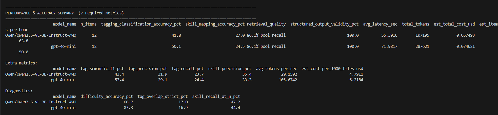
</p>

| Metric | Qwen | OpenAI |
|---|---:|---:|
| Tagging / Classification Accuracy | **41.8%** | **50.1%** |
| Skill Mapping Accuracy | **27.0%** | **24.5%** |
| Retrieval Quality | **86.1%** | **86.1%** |
| Structured Output Validity | **100%** | **100%** |
| Average E2E Latency | **56.39 s** | **71.98 s** |
| Throughput | **63.8 files/hr** | **50.0 files/hr** |
| Tag Semantic F1 | **43.4%** | **53.4%** |
| Difficulty Accuracy | **66.7%** | **83.3%** |

These measurements are specific to the capstone benchmark workload and test environment.

The canonical final benchmark outputs are stored in:

```text
results_final/
```

<details>
<summary><strong>View full benchmark execution</strong></summary>

<br>

<p align="center">
  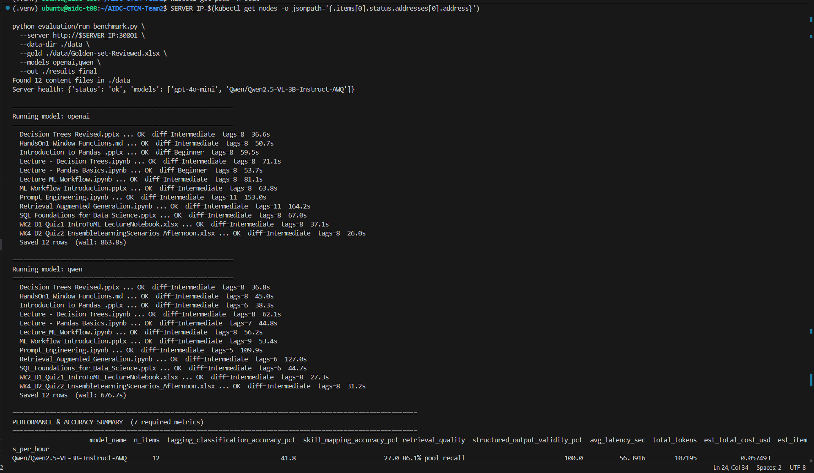
</p>

</details>

---

# Concurrent Benchmark

Concurrency was evaluated with:

- **3 simultaneous users**
- **3 representative files**
- Both Qwen and OpenAI
- **9 requests per model**

<p align="center">
  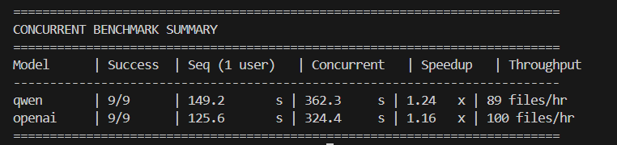
</p>

| Metric | Qwen | OpenAI |
|---|---:|---:|
| Successful Requests | **9/9** | **9/9** |
| Sequential Baseline | 149.2 s | 125.6 s |
| Concurrent Wall Time | 362.3 s | 324.4 s |
| Average Latency / File | 120.8 s | 108.1 s |
| Workload Speedup | **1.24x** | **1.16x** |
| Throughput | **89 files/hr** | **100 files/hr** |

Both model paths completed all concurrent requests successfully.

<details>
<summary><strong>Qwen concurrent benchmark details</strong></summary>

<br>

<p align="center">
  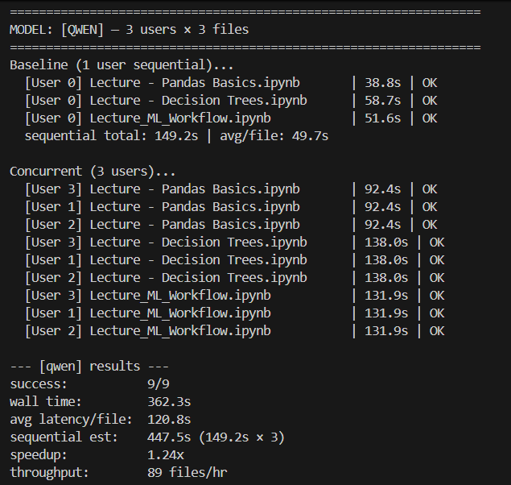
</p>

</details>

<details>
<summary><strong>OpenAI concurrent benchmark details</strong></summary>

<br>

<p align="center">
  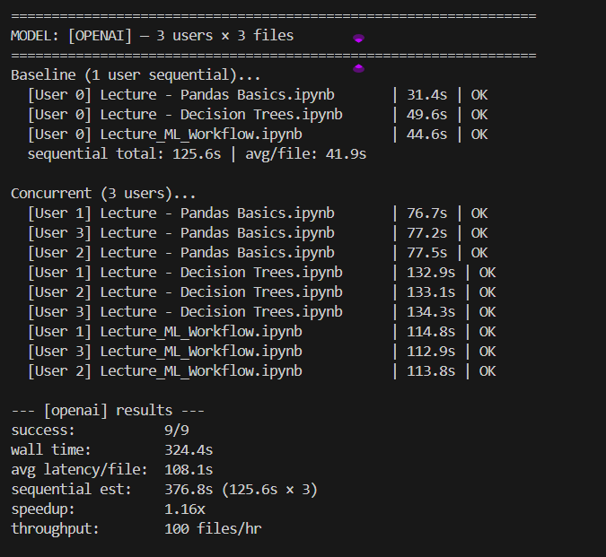
</p>

</details>

---

# Qwen Continuous Batching

Qwen is served using vLLM `AsyncLLMEngine`.

Three Qwen requests were launched simultaneously and completed successfully:

<p align="center">
  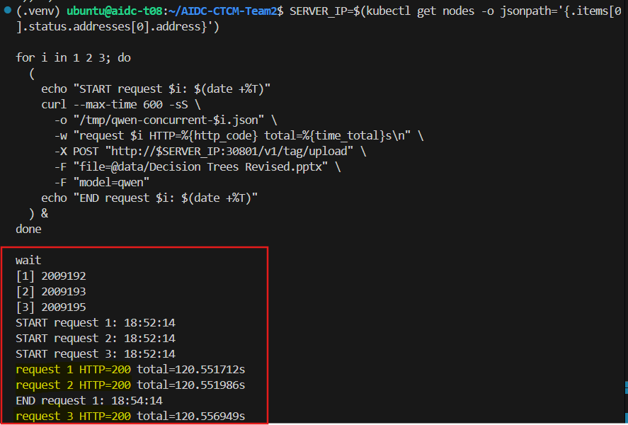
</p>

During concurrent inference, the vLLM runtime reported:

```text
Running: 3 reqs
Pending: 0 reqs
```

<p align="center">
  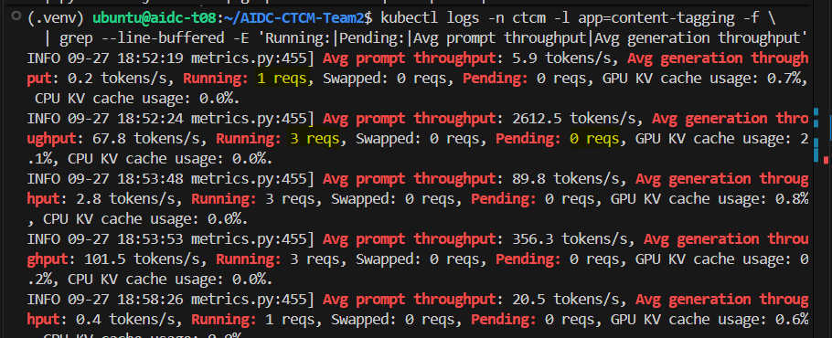
</p>

This provides runtime evidence that multiple Qwen inference requests were active in the vLLM engine simultaneously.

Individual application stages inside a request may still execute sequentially, while vLLM performs continuous batching across concurrent inference requests.

---

# API

The backend is implemented with **FastAPI**.

| Method | Endpoint | Purpose |
|---|---|---|
| `GET` | `/health` | Service health and loaded models |
| `GET` | `/metrics` | Prometheus metrics |
| `GET` | `/v1/models` | Available model backends |
| `POST` | `/v1/tag/upload` | Upload and analyze one file |
| `POST` | `/v1/tag` | Analyze a file through JSON |
| `POST` | `/v1/benchmark` | Run benchmark comparison |
| `GET` | `/v1/benchmark/summary` | Benchmark metric definitions |

Example:

```bash
curl -X POST http://<HOST>:8000/v1/tag/upload \
  -F "file=@data/Lecture - Pandas Basics.ipynb" \
  -F "model=qwen"
```

Available model values:

```text
qwen
openai
```

---

# Docker

The GPU container is defined in:

```text
docker/Dockerfile
```

Build:

```bash
docker build \
  -f docker/Dockerfile \
  -t noura93/content-tagging:gpu-v1 \
  .
```

Push:

```bash
docker push noura93/content-tagging:gpu-v1
```

<details>
<summary><strong>Docker build and push evidence</strong></summary>

<br>

<p align="center">
  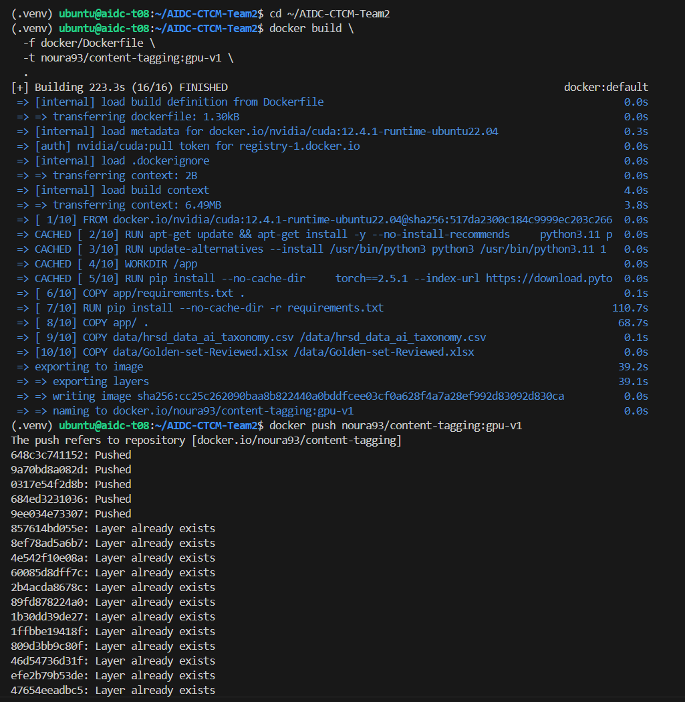
</p>

</details>

---

# Kubernetes Deployment

Kubernetes manifests are stored under:

```text
k8s/
```

```text
namespace.yaml
deployment.yaml
service.yaml
pvc.yaml
prometheus.yaml
grafana.yaml
secret.yaml
```

Deploy:

```bash
kubectl apply -f k8s/namespace.yaml
kubectl apply -f k8s/pvc.yaml
kubectl apply -f k8s/deployment.yaml
kubectl apply -f k8s/service.yaml
kubectl apply -f k8s/prometheus.yaml
kubectl apply -f k8s/grafana.yaml
```

## Lab NodePorts

| Service | NodePort |
|---|---:|
| CTCM API | `30801` |
| Grafana | `30301` |
| Prometheus | `30900` |

---

# Observability

The project uses:

- **Prometheus** for metric collection
- **Grafana** for dashboard visualization
- Application-level metrics for both model paths
- vLLM-native inference metrics for Qwen

Application metrics include:

```text
model_requests_total
model_request_duration_seconds
```

These metrics are labeled by model, allowing Qwen and OpenAI requests to be compared separately.

Qwen additionally exposes vLLM metrics for:

- Concurrent requests
- Waiting requests
- GPU KV-cache utilization
- Time to First Token (TTFT)
- Time per Output Token (TPOT)
- Queue time
- Prompt throughput
- Generation throughput
- Prefill / decode behavior

vLLM and GPU metrics apply only to **Qwen**, because OpenAI inference is handled through an external API.

The final exported Grafana dashboard is stored in:

```text
observability/CTCM — Infrastructure & Inference Benchmark Dashboard.json
```

---

# Service Indicators & Proposed Targets

The project's measured service indicators and proposed targets are documented in:

```text
observability/slo-targets.md
```

| Indicator | Proposed Target |
|---|---:|
| Scheduled-window Availability | `>= 99%` |
| Request Error Rate | `<= 1%` |
| E2E p95 Latency | `<= 180 s` per model |
| Successful Throughput | `>= 50 files/hour/model` |
| Qwen Concurrency | `>= 3 simultaneous requests` |

These are provisional objectives based on the measured capstone workload and are not production commitments.

---

# Streamlit Application

The interactive UI is located under:

```text
demo/
```

Install:

```bash
cd demo
pip install -r requirements.txt
```

Run:

```bash
streamlit run streamlit_app.py
```

---

# Local Setup

Clone:

```bash
git clone https://github.com/Noura93a/AIDC-CTCM-Team2.git
cd AIDC-CTCM-Team2
```

Create the environment:

```bash
python3.11 -m venv .venv
source .venv/bin/activate
```

Install dependencies:

```bash
pip install torch==2.5.1 \
  --index-url https://download.pytorch.org/whl/cu121

pip install -r app/requirements.txt
```

Set environment variables:

```bash
export OPENAI_API_KEY="<your-openai-api-key>"
export OPENAI_MODEL="gpt-4o-mini"

export SKILLS_CSV_PATH="$PWD/data/hrsd_data_ai_taxonomy.csv"
export GOLD_SET_PATH="$PWD/data/Golden-set-Reviewed.xlsx"
```

> Never commit a real API key or token to the repository.

Start the API:

```bash
cd app

uvicorn main:app \
  --host 0.0.0.0 \
  --port 8000 \
  --workers 1
```

Health check:

```bash
curl http://localhost:8000/health
```

---

# Run the Benchmarks

## Full Benchmark

```bash
python evaluation/run_benchmark.py \
  --server http://<HOST>:8000 \
  --data-dir ./data \
  --gold ./data/Golden-set-Reviewed.xlsx \
  --models openai,qwen \
  --out ./results_final
```

## Concurrent Benchmark

```bash
python evaluation/concurrent_benchmark.py
```

---

# Repository Structure

```text
AIDC-CTCM-Team2/
├── app/                  # FastAPI, extraction, models, RAG, scoring
├── data/                 # Golden Set, taxonomy, benchmark content
├── demo/                 # Streamlit application
├── docker/               # GPU Docker image
├── docs/
│   ├── images/           # Screenshots and benchmark evidence
│   └── gifs/             # Streamlit and Grafana demo GIFs
├── evaluation/           # Full and concurrent benchmark scripts
├── k8s/                  # Kubernetes + Prometheus + Grafana manifests
├── observability/        # Grafana dashboard + SLI/SLO targets
├── reports/              # Benchmark report
├── results_final/        # Canonical final benchmark outputs
└── README.md
```

---

# Additional Evidence

<details>
<summary><strong>Deployment readiness check</strong></summary>

<br>

<p align="center">
  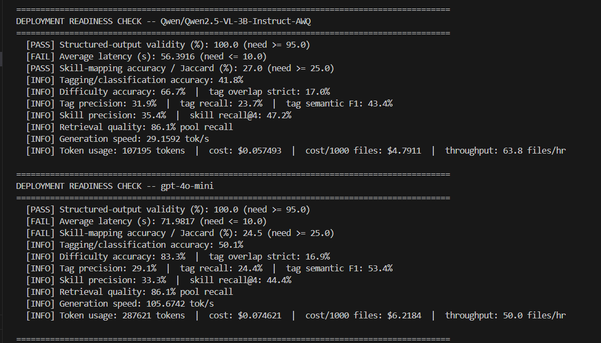
</p>

The readiness script used strict development thresholds. Its historical `< 10 s` average-latency threshold is different from the final capstone SLO documented in `observability/slo-targets.md`.

</details>

<details>
<summary><strong>Smoke test — both models</strong></summary>

<br>

<p align="center">
  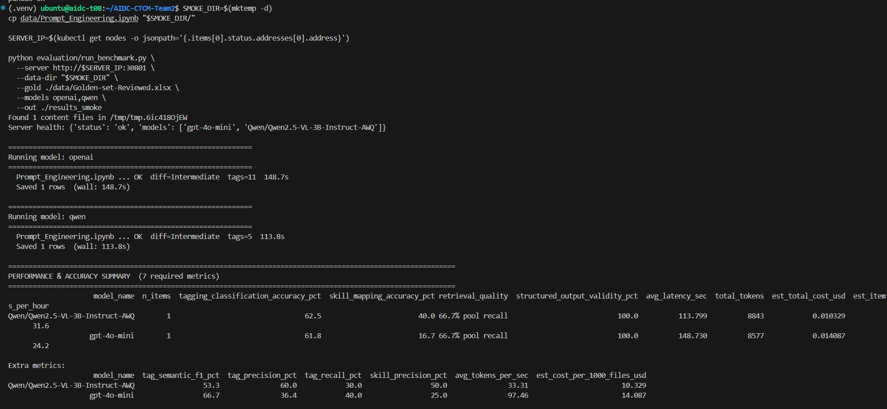
</p>

</details>

---

# Technologies

- Python 3.11
- FastAPI
- PyTorch
- vLLM
- Hugging Face Transformers
- Qwen2.5-VL
- OpenAI API
- BGE-M3
- Docker
- Kubernetes / k3s
- NVIDIA CUDA
- Prometheus
- Grafana
- Streamlit
- Pandas

---

# Security

Do not commit:

- OpenAI API keys
- GitHub PATs
- Passwords
- Private tokens
- Local credentials

Keep the repository version of `k8s/secret.yaml` empty or placeholder-only and inject real secrets at deployment time.

---

# Team

**Team 2 — AI Data Center Operations Capstone**

**Content Tagging & Competency Mapping (CTCM)**
